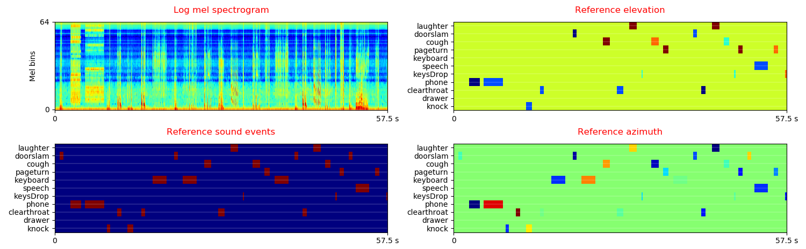
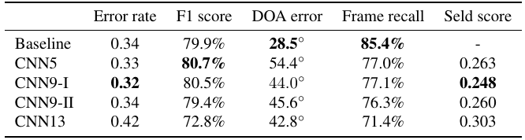
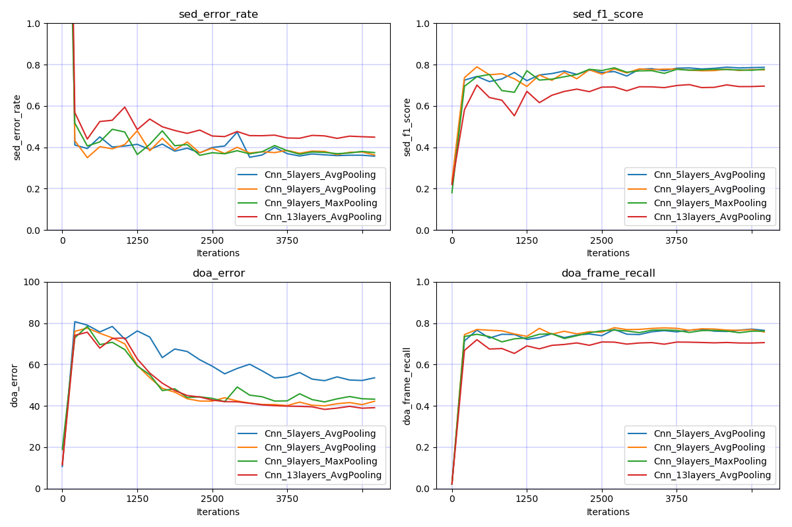
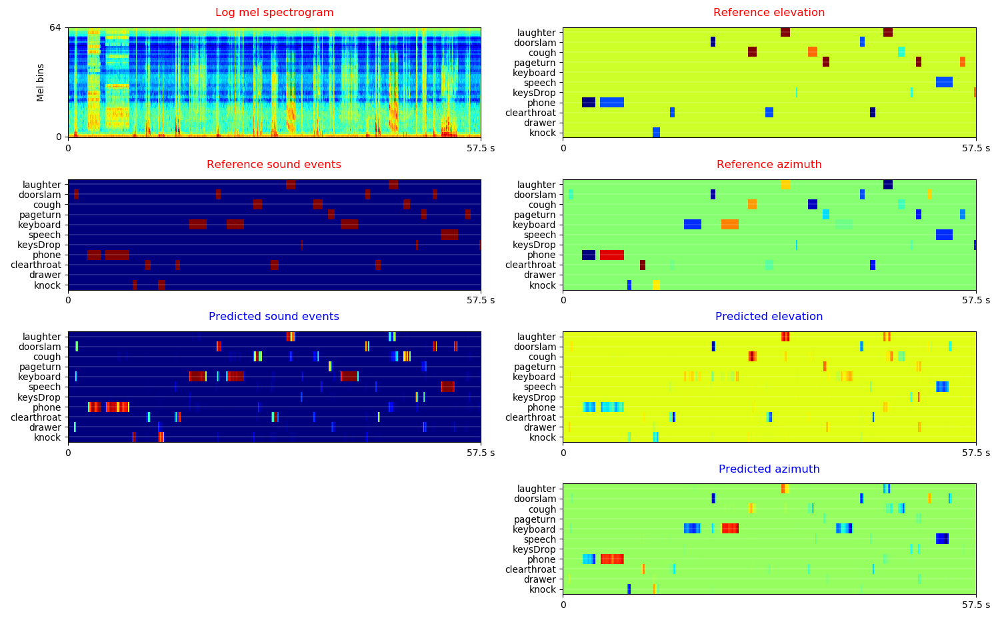

# DCASE 2019 Task 3 Sound Event Localization and Detection

DCASE 2019 Task3 Sound Event Localization and Detection is a task to jointly localize and recognize individual sound events and their respective temporal onset and offset times. More description of this task can be found in http://dcase.community/challenge2019/task-sound-event-localization-and-detection.

## DATASET
The dataset can be downloaded from http://dcase.community/challenge2019/task-sound-event-localization-and-detection. The dataset contains 400 audio recordings, one minute long recordings sampled at 48 kHz. Two formats of audio, First-Order Ambisonic (FOA) and microphone array (MIC) are provided for each audio recording. Both of FOA and MIC are 4 channels. Each one minute recording contains 11 synthetic polyphonic sound events. 

The statistic of the data is shown below:

|      |     Attributes    | Dev. recordings | Eva. recordings |
|:----:|:-----------------:|:---------------:|:---------------:|
| Data | FOA & MIC, 48 kHz |       400       |        -        |

The log mel spectrogram of the scenes are shown below:

## Run the code

**0. Prepare data** 

Download and upzip the data, the data looks like:

<pre>
dataset_root
├── metadata_dev (400 files)
│    ├── split1_ir0_ov1_10.csv
│    └── ...
├── foa_dev (400 files)
│    ├── split1_ir0_ov1_10.wav
│    └── ...
├── mic_dev (400 files)
│    ├── split1_ir0_ov1_10.wav
│    └── ...
└── ...
</pre>

**1. Requirements** 

python 3.6 + pytorch 1.0

**2. Then simply run:**

$ Run the bash script ./runme.sh

Or run the commands in runme.sh line by line. The commands includes:

(1) Modify the paths of dataset and your workspace

(2) Extract features

(3) Train model

(4) Inference

## Model
We apply convolutional neural networks using the log mel spectrogram of 4 channels audio as input. The targets are onset and offset times, elevation and azimuth of sound events. To train a CNN with 9 layers and a mini-batch size of 32, the training takes approximately 200 ms / iteration on a single card GTX Titan Xp GPU. The model is trained for 5000 iterations. The training looks like:

<pre>
Load data time: 90.292 s
Training audio num: 300
Validation audio num: 100
------------------------------------
...
------------------------------------
iteration: 5000
train statistics:    total_loss: 0.076, event_loss: 0.007, position_loss: 0.069
    Total 10 files written to /vol/vssp/msos/qk/workspaces/dcase2019_task3/_temp/submissions/main/Cnn_9layers_foa_dev_logmel_64frames_64melbins
    sed_error_rate :     0.057
    sed_f1_score :       0.971
    doa_error :          8.902
    doa_frame_recall :   0.966
    seld_score :         0.042
validate statistics:  total_loss: 0.449, event_loss: 0.039, position_loss: 0.409
    Total 10 files written to /vol/vssp/msos/qk/workspaces/dcase2019_task3/_temp/submissions/main/Cnn_9layers_foa_dev_logmel_64frames_64melbins
    sed_error_rate :     0.206
    sed_f1_score :       0.875
    doa_error :          33.374
    doa_frame_recall :   0.894
    seld_score :         0.156
train time: 20.135 s, validate time: 7.023 s
Model saved to /vol/vssp/msos/qk/workspaces/dcase2019_task3/models/main/Cnn_9layers_foa_dev_logmel_64frames_64melbins/holdout_fold=1/md_5000_iters.pth
------------------------------------
...
</pre>

## Results

**Validation result on 400 audio files**

**Plot results over different iterations**

**Visualization the prediction**

## Summary
This codebase provides a convolutional neural network (CNN) for DCASE 2019 challenge Task 3 Sound Event Localization and Detection. 

## Citation
To appear. 

## FAQ
If you met running out of GPU memory error, then try to reduce batch_size. 

## License
File evaluation_tools/cls_feature_class.py is under TUT_LICENSE. 

All other files except utils/cls_feature_class.py is under MIT_LICENSE. 

## External link

The official baseline system implemented using Keras can be found in https://github.com/sharathadavanne/seld-dcase2019
